# Material You Design个人主页
Copy From https://jimmycai.com/

## 使用方法

1. 自行查找并修改 `index.html`相关代码

2. 自行修改图标，可使用[Favicon.ico图标生成器)](https://www.logosc.cn/logo/favicon)一键生成，解压后放入根目录

3. 打开`index.js`选择配色方案

   

   `theme`为亮色主题下默认配色方案，`Darktheme`为暗色模式配色方案

   配色方案选择请参考下方，填写字符串

   填写`random`时为随机

## 配色方案一览

1. Default

   
   

2. Pink

   
   

3. Blue
   
   

4. Yellow

   
   

5. Green

   
   

6. Purple

   
   

7. Red

   
   

8. Orange
   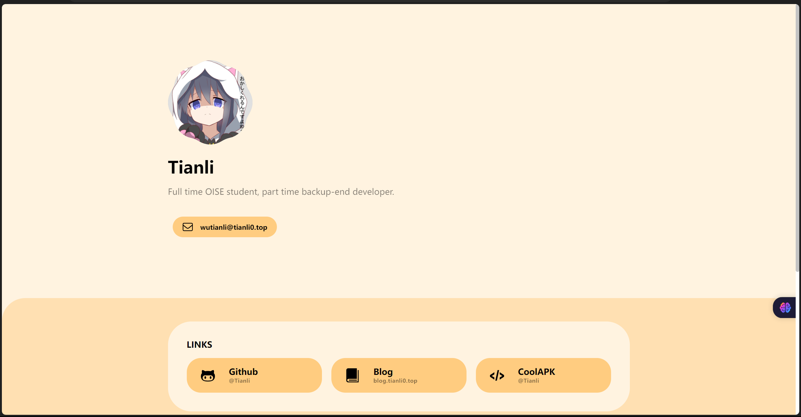

   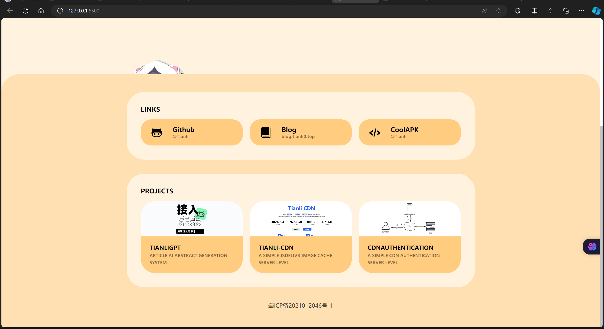

9. Gray
   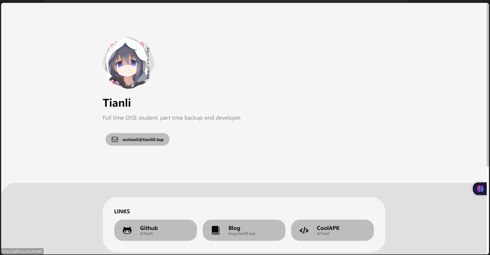

   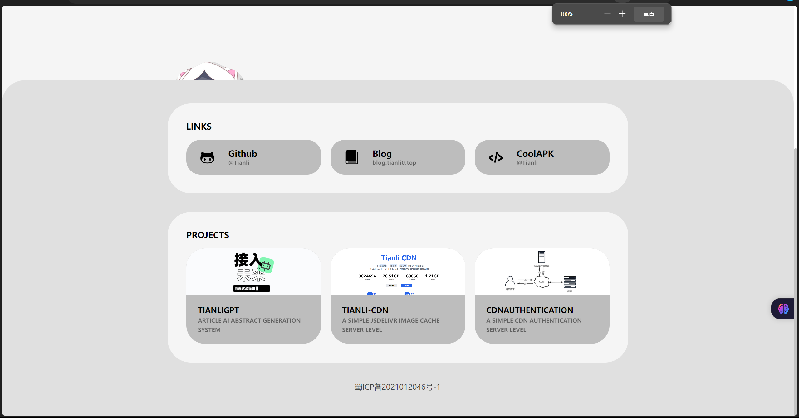

10. DeepSkyBlue
    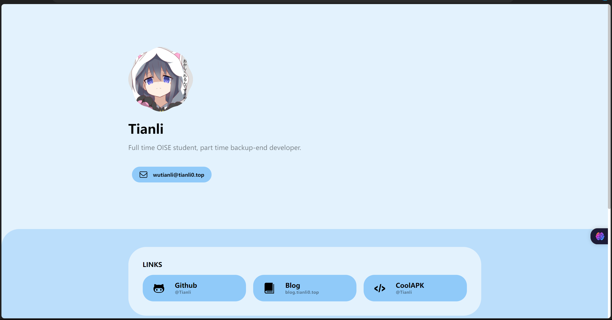

    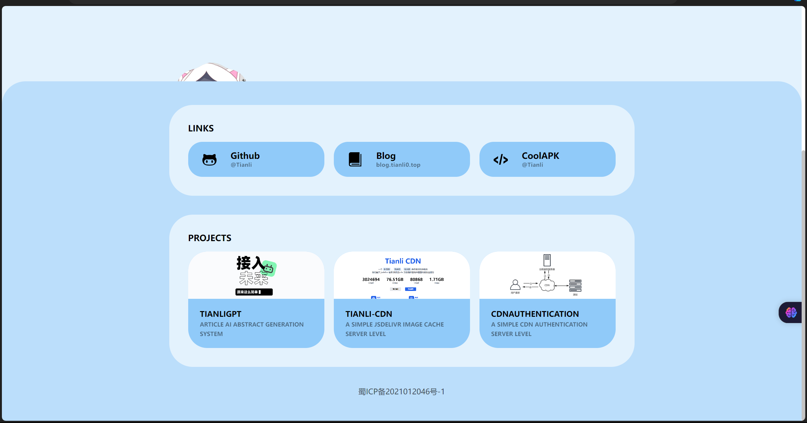

11. Fuchsia

    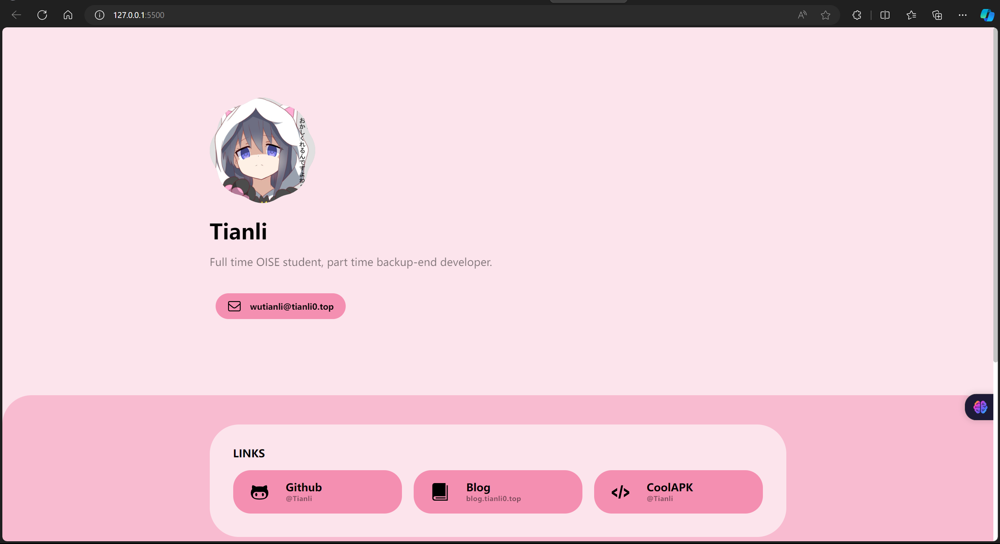

    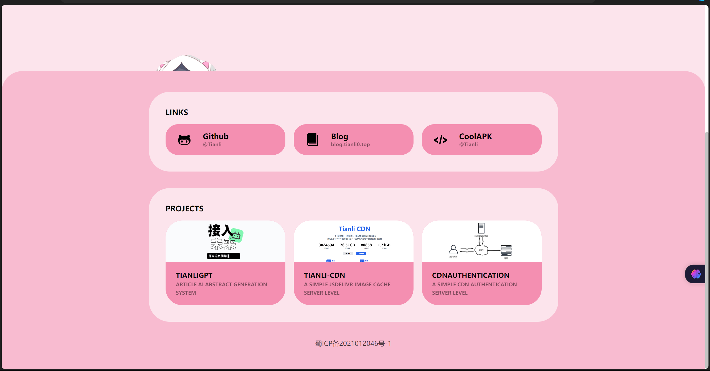

12. Brown

    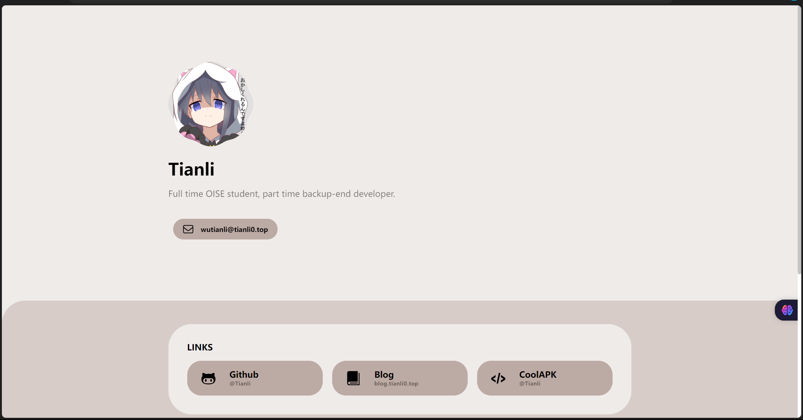

    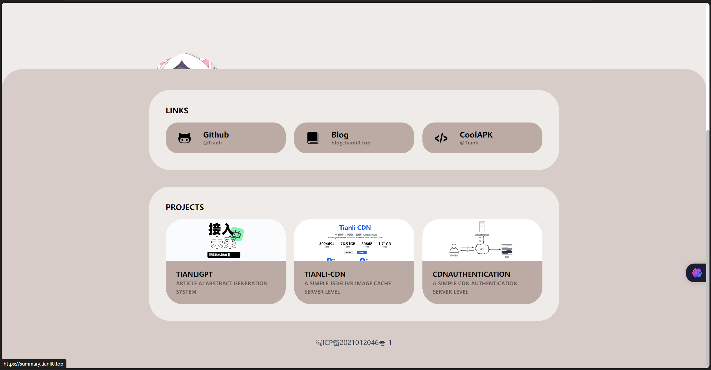

13. PaleTurquoise

    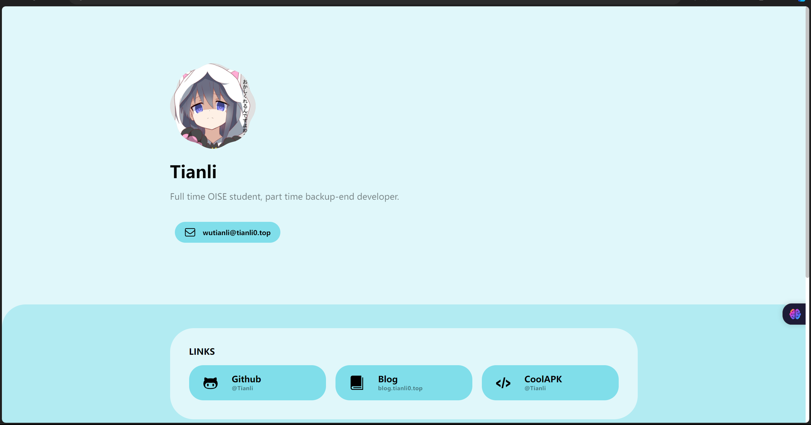

    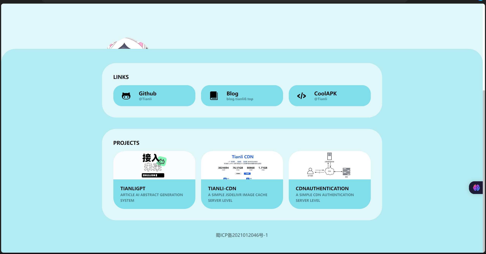

14. LightGreen

    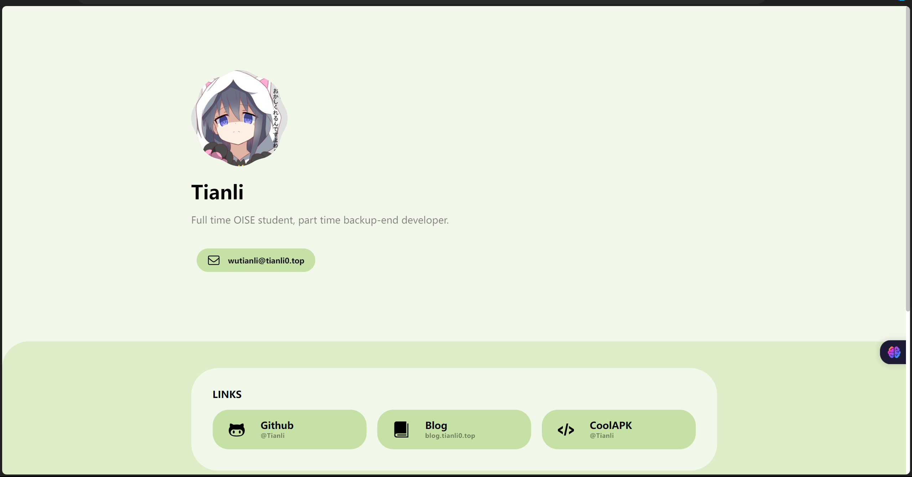

    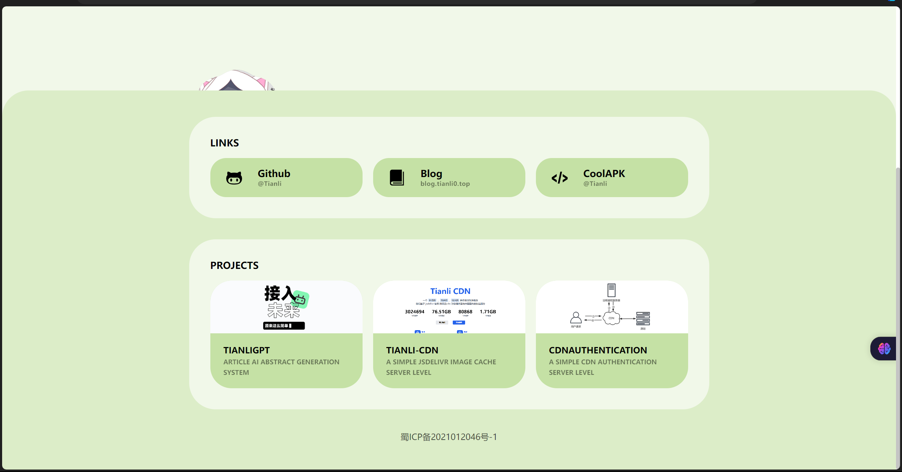

15. AliceBlue

    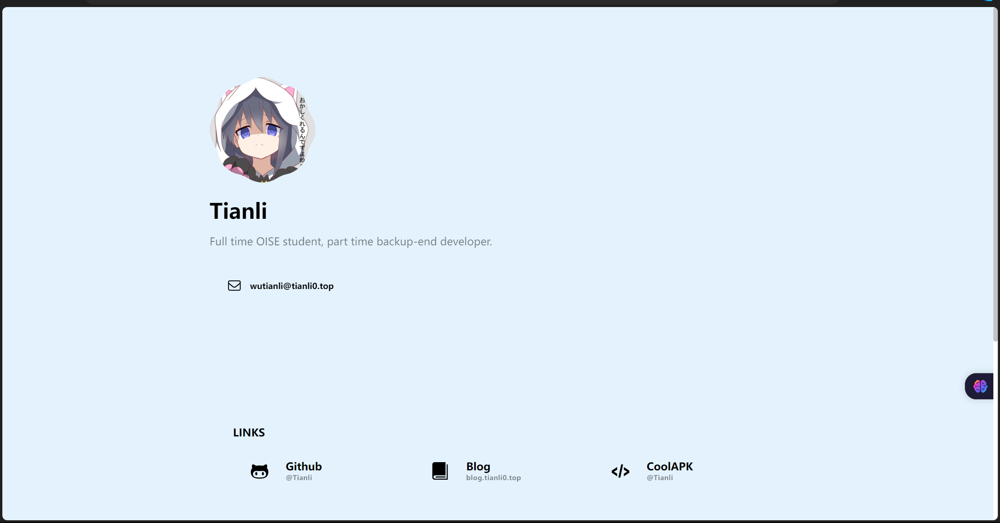

    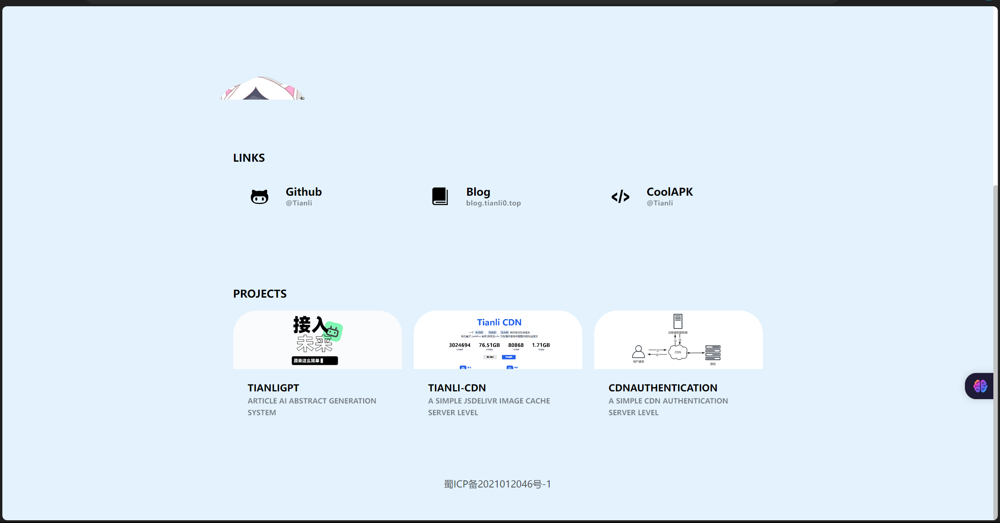

    